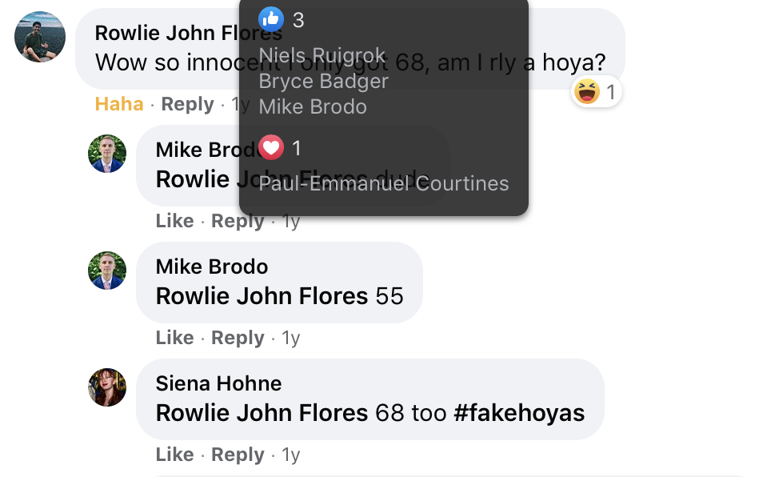
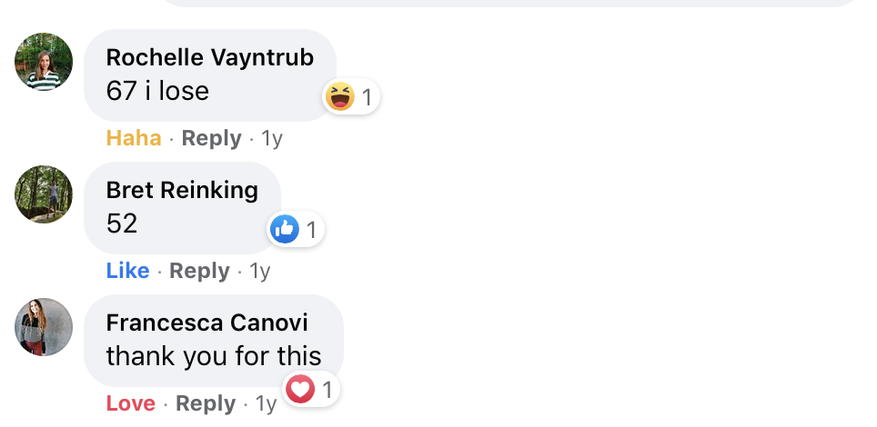
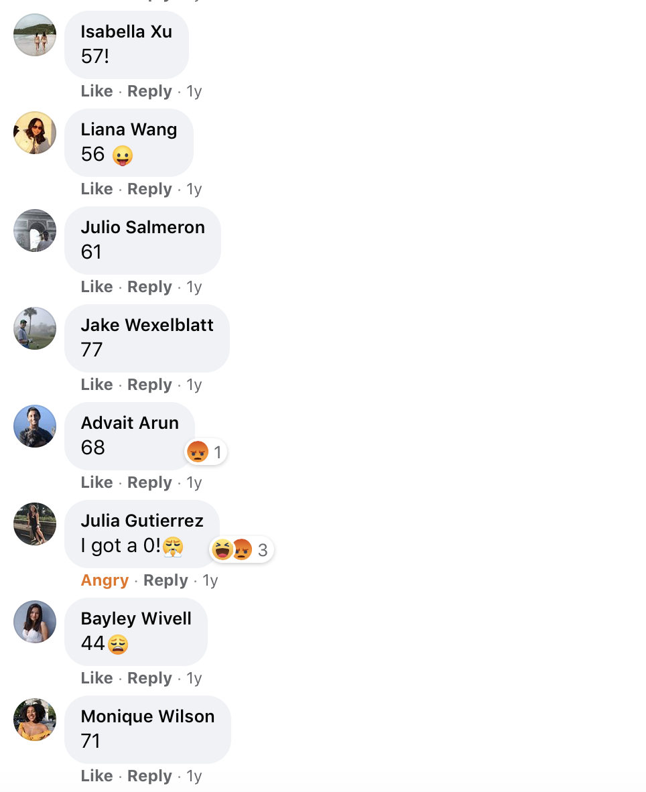
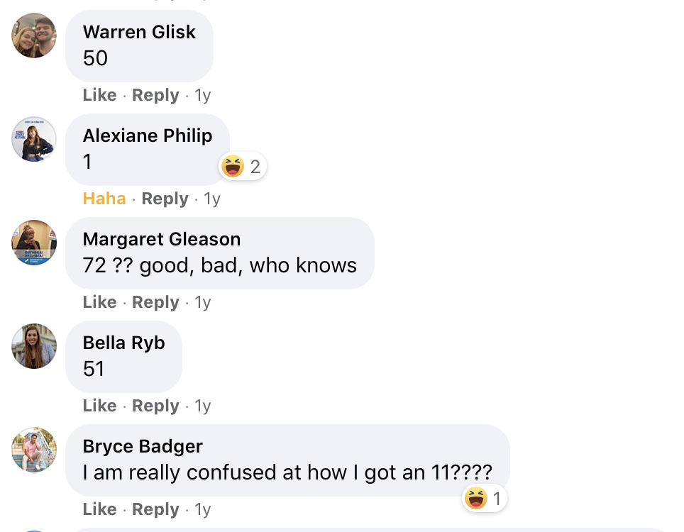

# Hoya-Purity-Test

## Background
This project built a "purity test" modeled on the Rice Purity Test (http://ricepuritytest.com). 

For the uninitiated, the Rice Purity Test is a self-graded survey that assesses the participants' supposed degree of innocence in worldly matters (sex, drugs, deceit, and other activities assumed to be vices), on a percentage scale with 100% being the most and 0% being the least pure. The Hoya Purity Test builds on this tradition, conserving certain questions about vices, but also broader questions about Georgetown's club culture, classes and other notorious traditions.

From March to July 2019, this project was hosted at https://hoyapuritytest.xyz

## Response 

The test was highly sucessful, with over 1,800 unique IP visits in the first month and 6,000 total visits as friends took it multiple times, encouraged their friends to try it, etc. 

## How it works 

The main parts of the website are built in HTML, with some limited CSS formatting (this is quite limited to conserve an appearance most smilar to the barebones Rice test). JavaScript was used for the animations and to build functionality. 

## Acknowledgements
This project was imagined, planned and built with Kelly Thomas. 
